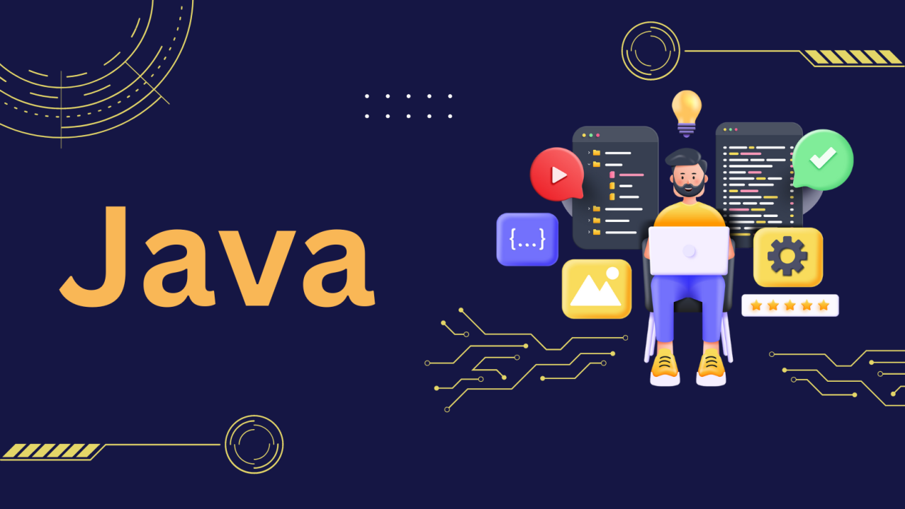
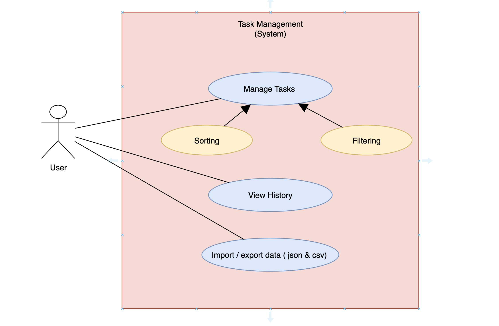
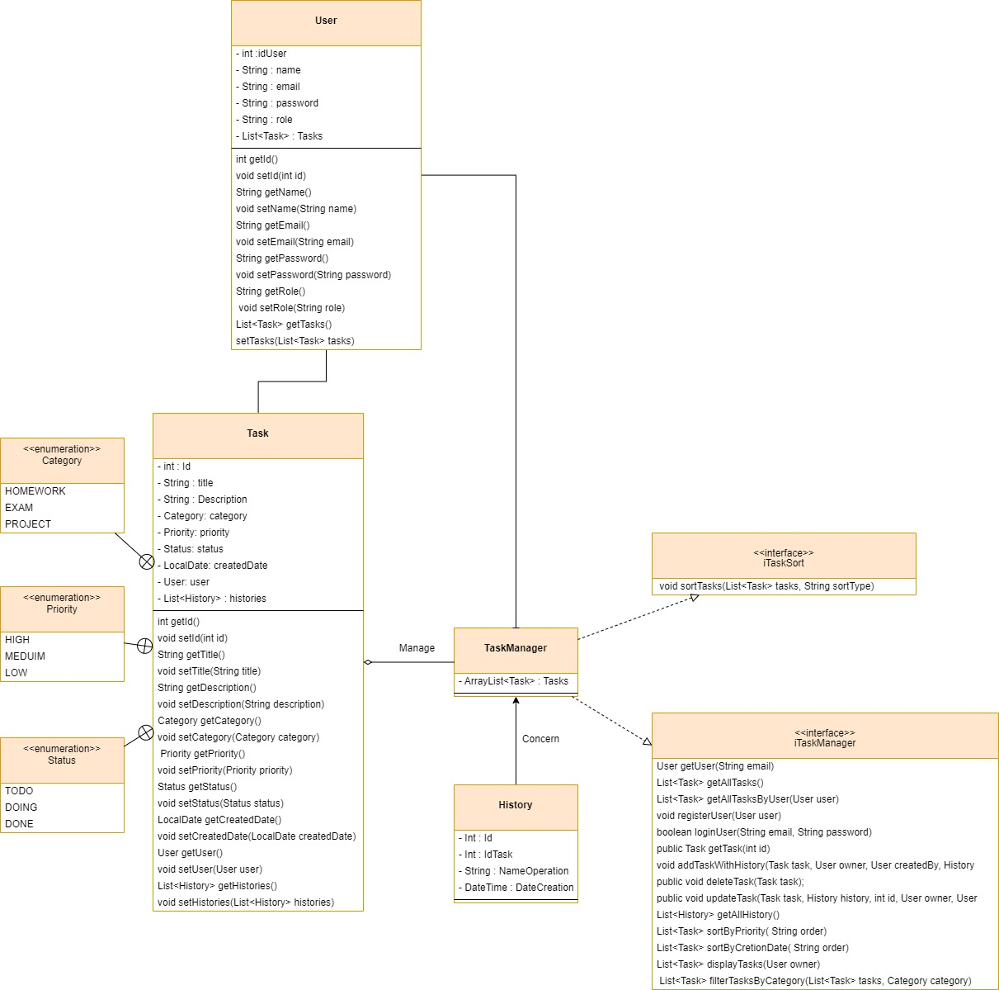
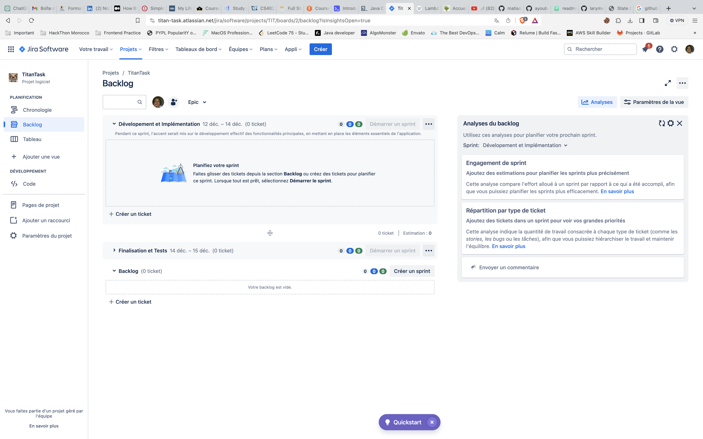

<h1 align="center">
  Java Titan Task
</h1>

  

## 📝 Table of Contents
- [Description](#description)
- [Project Goals](#project-goals)
- [Soft Skills](#soft-skills)
- [Conception](#conception)
- [Team Members](#team-members)
- [Tools Used](#tools-used)
- [Installation](#installation)
- [Screenshots](#screenshots)

## 🧐 Description 
The TitanTask application is a comprehensive task and project management tool, specifically tailored for the educational environment of Titan School. It is designed to streamline the planning, tracking, and collaboration processes among educators, thereby significantly enhancing operational efficiency. By providing a user-friendly interface and a host of features, TitanTask aims to transform the way educational staff members manage their tasks and projects. 
## 🎯 Project Goals 
The principal goal of the project is to use different Java Concepts and Design Patterns to build a real-world application. Here's a list of the concepts and design patterns used in the project:

1. Reference method
2. Optionals
3. Java Time API
4. Collection API - Hashmaps
5. Garbage Collection
6. Functional Interfaces - Lambda Expressions
7. Java Stream API

## 🤝 Soft Skills 
This project is a group project, so it will help us to improve our soft skills like:

- Teamwork
- Communication
- Time Management
- Problem Solving

## 📝 Conception 
### Use Case Diagram

### Class Diagram

### Main features of the application :
- Login
- Register
- Add a task
- Show tasks
- Edit a task 
- Delete a task
- sort tasks
- filter tasks
- Show history
- Export Stains in csv file
- Import Stains from a csv file to a given database

## 👥 Team Members 
In this project, we are 6 members working together to build this application. Here are their GitHub profiles:
- https://github.com/Ryukiro
- https://github.com/Rachid-Boutahir
- https://github.com/MohamedChergaoui
- https://github.com/hasnaou
- https://github.com/Halima-el-amri
- https://github.com/ayoub-ait-si-ahmad

## 🛠️ Tools Used 
- IntelliJ IDEA
- Git
- GitHub
- Tower
- Draw.io
- Xampp

We also used Jira to manage our project between team members and work in an agile way.

## 🚀 Installation 
1. Clone the repository
2. Open the project in IntelliJ IDEA
3. Create Database Titan Task
4. Change The Username and the password also the port
5. Run the project

## 📸 Screenshots 

